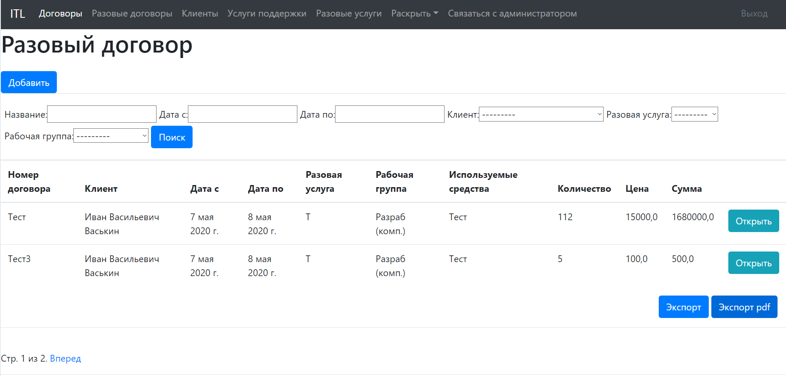
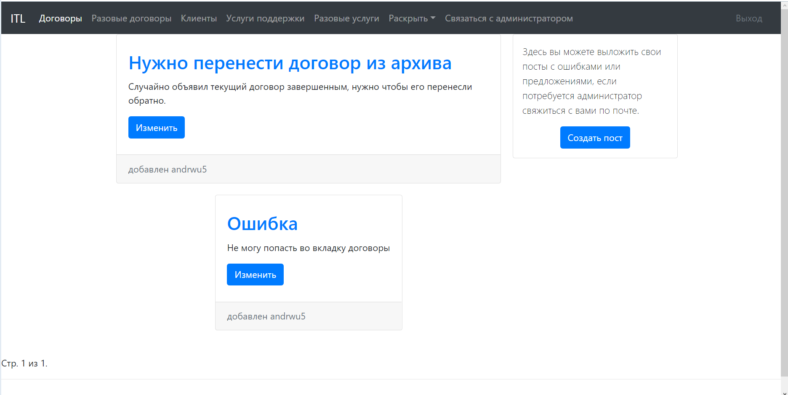
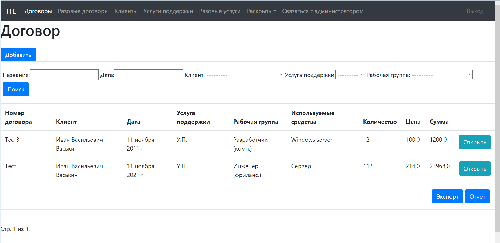

# Monitoring for contracts

A website for accounting It contracts of the company, 
with the ability to export data in the required reporting format (.pdf, .xls) 
and with a CRM system.

## Installation:
1) Follow the link: https://github.com/andrwu5/Monitoring_for_contracts
2) Press green button "Code"
3) In the drop-down list that opens, select how you want to install the project

### Download Zip:
1) Download any IDE supporting Python language and Django framework
2) Press button "Download Zip"
3) The "download" folder will contain the downloaded archive, unzip it to any place on your computer
4) Open IDE next press button "File" -> "Open" and choose unzip directory
5) Project will open in IDE and you can start working with this program 

## Usage
After authorization, you go to the main page "contracts", depending on your role, you can edit the table located there.

If necessary, you can leave a post with an error for further consideration by the administrator.

If necessary, you can export the table data to a report.

